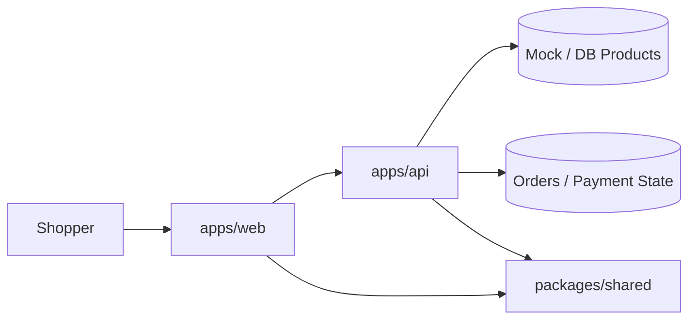

# 🛍️ JMart


Premium ecommerce storefront for the Ethiopian market, built as a polished monorepo with a modern React frontend, Express API, shared domain types, and a checkout flow that feels ready for real customers.

## ✨ Highlights

- 🎨 Premium storefront UI with light and dark themes
- 🌍 English + Amharic ready layout and shared locale support
- 🛒 Product catalog, product detail, cart drawer, and checkout flow
- 💳 Mock Chapa payment handoff and receipt screen
- ⚡ Fast local development with Vite and workspace scripts
- 🧩 Shared contracts across frontend and backend

## 🧱 Project Structure

```text
apps/
	web/      # React + Vite storefront
	api/      # Express API with order and product routes
packages/
	shared/   # Shared types, catalog data, and translations
```

## 🗺️ How It Fits Together



## 🚀 Quick Start

```powershell
npm install
npm run dev:api
npm run dev:web
```

Then open the storefront in your browser at the Vite URL shown in the terminal.

## 🛠️ Scripts

| Command | What it does |
| --- | --- |
| `npm run dev:web` | Starts the storefront dev server |
| `npm run dev:api` | Starts the backend API server |
| `npm run build` | Builds all workspaces |
| `npm run lint` | Runs linting across the repo |
| `npm run typecheck` | Runs TypeScript checks across the repo |

## 📦 Apps

### `apps/web`

The customer-facing storefront. It includes:

- animated homepage sections
- catalog search, filter, and sort
- product detail pages
- cart drawer and checkout
- receipt / success screen

### `apps/api`

The Express API that powers product browsing, order creation, and mock payment state updates.

### `packages/shared`

Shared types, translations, and fallback catalog data used by both the web app and the API.

## 🛒 Storefront Features

<details>
<summary><strong>Homepage</strong></summary>

- rotating hero product spotlight
- category cards
- best-seller section
- checkout preview
- premium footer

</details>

<details>
<summary><strong>Catalog</strong></summary>

- real product cards
- search by name, description, and tags
- featured / new arrival / in-stock filtering
- price and rating sorting

</details>

<details>
<summary><strong>Checkout</strong></summary>

- Ethiopia-first shipping fields
- mock Chapa payment seam
- receipt page with order status polling

</details>

## 🎨 Design Direction

- Soft gradients instead of flat blocks
- Glass-like header and footer surfaces
- Motion used for emphasis, not noise
- Premium typography and spacing for a more boutique feel

## 🧪 Development Notes

- The API can fall back to in-memory orders when MongoDB is unavailable.
- The storefront uses shared catalog data so it still looks complete during local development.
- The hero and homepage sections are designed to feel like a real ecommerce landing page, not a portfolio template.

## 📌 Roadmap

- Real MongoDB persistence for products and orders
- Real Chapa webhook verification
- Admin dashboard for inventory and order tracking
- More product categories and brand sections

## 🤝 Contributing

1. Create a branch.
2. Make your changes.
3. Run `npm run build`.
4. Push and open a pull request.

## 📄 License

Private project for JMart development.